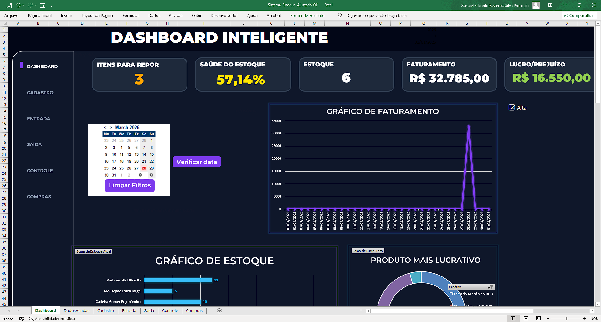
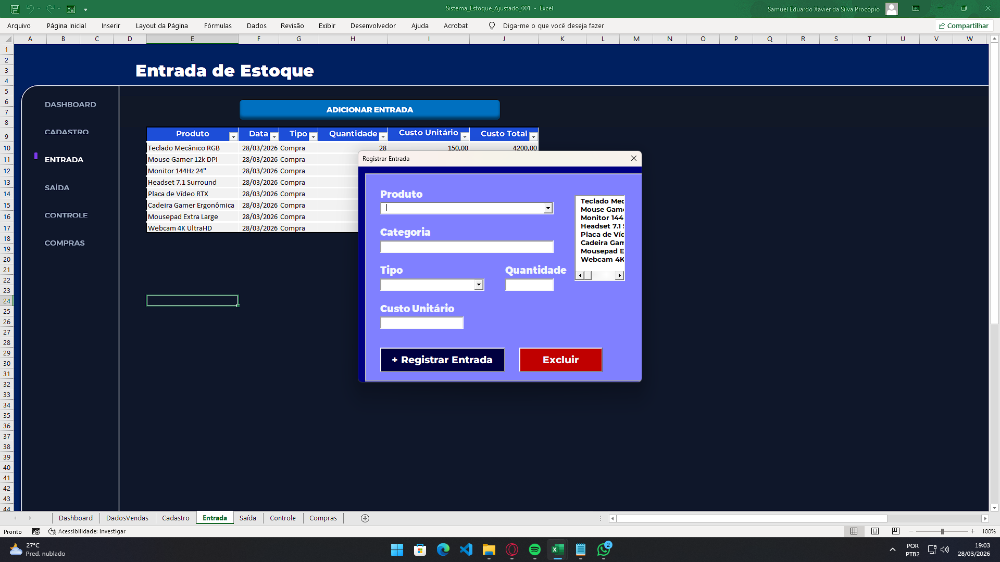

## 📊PlanilhaLab
Projetos simples, objetivos e úteis. Cada planilha aqui foi criada para resolver um problema real.

[ A1 ] Projeto: Coleção de Planilhas  
[ A2 ] Tipo: Portfólio  
[ A3 ] Conteúdo: Arquivos Planilhas (.xlsx)  
[ A4 ] Status: Em constante atualização

### 📸 fotos dos projetos

  
  

Funcionalidades Chave
Saúde do Estoque:Monitoramento via KPIs dinâmicos e cores Neon.
Previsão de Ruptura: Cálculo automático de quantos dias o estoque vai durar.
Aba de Compras: Sugestão inteligente de reposição baseada no giro.
UX Avançada: Interface Dark Mode com navegação fluida.

---
*Desenvolvido por SamCodesDev*
